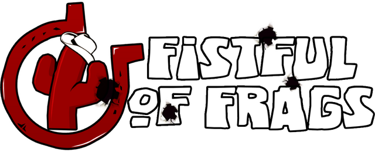

# Fistful of Frags Reconstruction Project (*ReFoF*) 

ReFoF is an unofficial reconstruction of the **Fistful of Frags** client and
server game modules. It aims to reproduce retail behavior in readable,
maintainable source code while documenting the few intentional differences.

ReFoF is based on AlliedModders HL2SDK commit
`4c56ee5bc8bfe00793abb7d40eb3f6fb040f10d2` and keeps the standard HL2MP
project layout. This repository contains source and build tools only; a legal
FoF installation is still required for maps and other game assets.

## Reconstruction scope

The items below describe retail FoF behavior reproduced by ReFoF. They are not
a list of defects in the retail game.

### Networking and prediction

- Retail-compatible network tables, class registration and data layouts.
- Prediction across the player, both weapon hands and both view models.
- FoF movement states including wall jumps, sliding, kicks and horse movement.
- Single- and dual-wield aiming, recoil, sights, FOV, reload and draw states.
- Throwable, dynamite, death, respawn, spectator and SourceTV transitions.

### Gameplay, modes and bots

- Retail pickup rules and thrown-weapon, physics-prop and explosive behavior.
- Mode-specific teams, cash, purchases, spawns, rounds and objectives instead
  of generic HL2MP fallbacks.
- Course task flow, voting, map-state reset and objective progression.
- Bot formations, following rules, navigation, combat, healing and respawning,
  including map-specific Course behavior.
- Round cleanup for weapons, projectiles, ragdolls and breakable map objects.

### Presentation

- Third-person movement, foot placement, airborne poses and FoF gestures.
- Player models, body groups, ragdolls and observed weapon presentation.
- Team colors, health glow, kill notices, objectives, scoreboards and SourceTV
  overlays.
- Movement, weapon, bot, zombie and Course event sound cues.

## Intentional changes from retail

- **Server-authoritative loadouts:** item IDs, categories, progression, point
  limits, prices, buy zones and cash are validated before equipment is granted.
- **Enemy Target ID:** `fof_hud_targetid_show_enemies 1` optionally displays
  enemy player information and is saved in `cfg/config2.cfg`.
- **Course replay reset:** replaying a Course can also reset frags, deaths,
  notoriety and round counters.
- **Modern display handling:** selected legacy panels retain their composition
  at current resolutions, while scoreboard rows adapt to the available height.
- **Input consistency:** vertical sensitivity is independent of `sv_cheats`,
  and scoped sensitivity follows the actual sight state.
- **Modern build generation:** bundled VPC tools generate Visual Studio 2022
  Win32 projects and Linux32 Ninja projects.

Dormant retail code such as Ranked Shootout is preserved in the source while
remaining hidden from the launcher where the retail game also hid it.

## Building

### Windows

Requirements: Visual Studio 2022 or newer, Desktop development with C++, MSVC
v143 x86/x64 tools, and a Windows 10 or 11 SDK. MFC/ATL is only needed for the
optional legacy tools.

```bat
creategameprojects.bat
```

Open `games.sln` and build `Debug|Win32` or `Release|Win32`. Use
`createallprojects.bat` for the complete SDK solution.

The game modules are copied to:

```text
../game/mod_hl2mp/bin/client.dll
../game/mod_hl2mp/bin/server.dll
```

### Linux

Requirements: an x86-64 Linux host, Bash, Ninja, GCC/G++ 11 or newer with
multilib support, and 32-bit development files for libc, libstdc++, UUID, SDL2
and FreeType. The 64-bit bundled VPC runs on the host while the generated
modules remain ELF32/i386 for the retail engine. Set `CC` and `CXX` to select a
specific compiler version.

```bash
bash creategameprojects release
ninja -f _vpc_/ninja/games_release.ninja

bash creategameprojects debug
ninja -f _vpc_/ninja/games_debug.ninja
```

Use `createallprojects` and the corresponding `everything_<mode>.ninja` file
to build the complete project set.

## Source layout

ReFoF is integrated directly into HL2MP rather than implemented as an isolated
plugin. Files outside the `fof` directories are modified where retail FoF
extends an SDK base class or depends on an exact network, virtual-function or
prediction layout.

| Path | Contents |
| --- | --- |
| `game/{client,shared,server}/fof` | FoF-specific UI, weapons, movement, rules, modes, bots and entities |
| `game/{client,shared,server}/hl2mp` | Player/rules integration, animation, registration and HL2MP entry points |
| `game/client`, `game/shared`, `game/server` | SDK base entities, prediction, view models, movement, physics and HUD paths used by FoF |
| `game/{client,server}/hl2` | Reused HUD, cannon and entity behavior required by FoF |
| `public` | Interface, data-layout, VGUI and engine-facing compatibility changes |
| `vpc_scripts`, `devtools/bin`, `create*projects*` | Windows/Linux project generators and build configuration |
| `utils/lzma`, `mathlib` | Source-built tool dependencies and modern compiler compatibility |

## Installation

Back up the retail game modules before replacing them. Install the generated
client and/or server module in the corresponding FoF `bin` directory. Do not
distribute retail assets or original FoF binaries with ReFoF.

## Limitations

- The retired GlobalFoF account/rank backend is not re-hosted.
- Original maps, assets and retail binaries are not included.
- Some retail quirks are retained when shipped maps or scripts depend on them.

## Legal note

ReFoF is an independent compatibility and preservation project. It is not an
official Valve or Fistful of Frags release and is not endorsed by either.

No license file is included. Do not assume rights beyond those granted by the
upstream Source SDK and the applicable rights to individual contributions.
